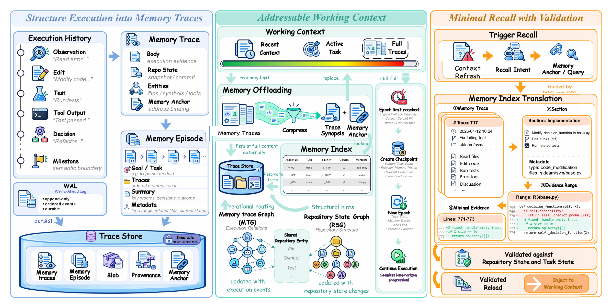

<div align="center">
  <h1>MemTrace</h1>
  <p><strong>State-consistent memory for long-horizon coding agents</strong></p>
  <p>
    <a href="https://github.com/Homy-Xu/MemTrace/blob/main/LICENSE"></a>
    
    
    
  </p>
</div>

<div align="center">
  
</div>

MemTrace helps coding agents continue long-horizon repository work after their
active context has been refreshed. It records execution as immutable **Memory
Traces**, binds each trace to the repository state in which it was produced,
and keeps only the evidence needed for the next action in **Working Memory**.
Historical evidence is restored only after it has been aligned with the current
task and repository state.

The runtime exposes the same provider-neutral lifecycle to two backends:

- **Codex CLI** — native JSONL events, planning, workspace revisions,
  memory-tool callbacks, and context recovery through the App Server.
- **mini-swe-agent 2.4.6** — native trajectories with model/tool events,
  token usage, cost, wall-clock time, and exit status.

## 🧭 Contents

- [Architecture](#-architecture)
- [How the modules work](#how-the-modules-work)
- [Installation](#-installation)
- [Run a Harness](#-run-a-harness)
- [Benchmark adapters](#-benchmark-adapters)
- [Receipts and reproducibility](#-receipts-and-reproducibility)
- [Terminology](#-terminology)
- [Project layout](#-project-layout)
- [Limitations](#-limitations)
- [License](#-license)

## 🧠 Architecture

MemTrace addresses **task-state drift** and **state-memory misalignment**. The
method has three connected responsibilities:

1. **Memory Trace formation** — consolidate completed observations, edits, test
   outcomes, decisions, and corrections with repository and provenance anchors.
2. **MTG–RSG alignment** — connect the Memory Trace Graph (MTG), which records
   execution relations, with the Repository State Graph (RSG), which describes
   the current files, symbols, and tests.
3. **Validated restoration** — localize Trace Candidates, perform Trace
   Validation and State Alignment Checks, and load only the evidence required
   to continue from the Execution Frontier.

The provider-neutral lifecycle is:

```text
start_session → plan → next_event / execute → checkpoint → resume → usage → close
```

See [docs/architecture.md](docs/architecture.md) for the method-level data
flow and [docs/overview.pdf](docs/overview.pdf) for the architecture
illustration.

## How the modules work

Both harnesses call the same runtime. The paper's three steps — state-bound
Memory Traces, MTG–RSG projection, and validated restoration — are carried by
five modules. A Memory Trace is an immutable record of one completed
observation, edit, test result, decision, or correction. The two graphs do
not share nodes.

| Module | Keeps | Produces |
| --- | --- | --- |
| Planning | The task text and what is still unresolved | The Execution Frontier and its Execution Milestones |
| Trace Store | Completed observations, edits, tests, and corrections | An immutable Memory Trace and one Memory Anchor |
| Memory Trace Graph (MTG) | Order, dependency, verification, correction, and supersession | Relations among Memory Traces |
| Repository State Graph (RSG) | Current files, symbols, and tests | `defines`, `calls`, `imports`, and `covers` relations |
| Validated restoration | Trace Candidates after a Context Refresh | Working Memory that contains only evidence that still applies |

**Graph anchoring.** An anchor addresses one side of the pair. A Memory Anchor
addresses exactly one Memory Trace. A Repository Anchor addresses one file,
symbol, or test. Sealing a trace does not copy RSG nodes into the MTG, and it
does not copy traces into the RSG. It records a projection: each file, symbol,
or test cited in the trace body becomes a pair `(Memory Trace, repository entity)`.

Lookup follows that pair in both directions:

```text
Memory Anchor → MTG → repository entity → RSG → Trace Candidate → Working Memory
```

1. Start from the Memory Anchor held by the Execution Frontier.
2. Walk MTG relations to the traces that support, verify, correct, or supersede that frontier.
3. Read the repository entities on those traces, then walk RSG relations to the current files, symbols, and tests.
4. Look those entities back up in the projection. The traces that come back are Trace Candidates.
5. Admit a candidate only after Trace Validation and a State Alignment Check: its recorded repository state still matches, and no later trace has superseded it. A neighboring file or symbol is not, by itself, evidence that still applies.

Only the admitted evidence is restored into Working Memory. Trace bodies that
leave the active context stay in the Trace Store; Working Memory keeps the
Memory Anchor and a Trace Synopsis. The presentation of this table and path
follows the mechanism summary in
[RPG-ZeroRepo](https://github.com/microsoft/RPG-ZeroRepo). MemTrace uses the
pair to recover execution evidence, not to generate a repository from a plan.

## ⚡ Installation

MemTrace requires Python 3.11 or newer.

```bash
python -m venv .venv
source .venv/bin/activate
python -m pip install -e '.[dev]'
```

Install one harness. Add `multilang` when the repository is not Python; it
pins the tree-sitter grammars used by the Repository State Graph.

```bash
python -m pip install -e '.[codex,multilang]'
# or
python -m pip install -e '.[mini-swe-agent,multilang]'
```

Codex CLI pins `openai-codex-cli-bin==0.144.4`. mini-swe-agent pins
`mini-swe-agent==2.4.6`. Credentials are read from protected environment
variables. Literal keys are never accepted in configuration files or command
arguments. Start from [.env.example](.env.example) and keep the populated file
outside Git.

## 🚀 Run a Harness

Use a fresh run root for every task. A run root contains the event ledger,
durable trace state, checkpoints, trajectories, and receipts and is never
reused across attempts.

Both DeepSWE commands below use the same profile: `deepseek-v4-flash-0731`,
reasoning effort `high`, a 200,000-token context, native compaction disabled,
and a budget of 200 execution turns and 14,400 seconds. The credential is
`MEMTENSOR_DOMESTIC_API_KEY`. Set `HOMY_ENABLE_CODE_GRAPH_SEARCH=1` for either
harness. The shared profile filename is a compatibility label, not the name of
the method.

### Codex CLI

Codex CLI sends turns through the App Server. Validate the profile, then start
a fresh run root:

```bash
export MEMTENSOR_DOMESTIC_API_KEY='set-this-locally'
export HOMY_ENABLE_CODE_GRAPH_SEARCH=1

memtrace validate-config \
  --config configs/codex/memtensor-deepseek-v4-flash-0731-five-stage.json

memtrace run \
  --harness codex \
  --config configs/codex/memtensor-deepseek-v4-flash-0731-five-stage.json \
  --model deepseek-v4-flash-0731 \
  --reasoning-effort high \
  --repository /path/to/repository \
  --task-file task.txt \
  --run-root /tmp/memtrace-codex-run
```

For a non-Python repository, record the pre-run commit and add
`--multilang-plan`:

```bash
export HOMY_MULTILANG_BASE_COMMIT="$(git -C /path/to/repository rev-parse HEAD)"

memtrace run \
  --harness codex \
  --multilang-plan \
  --config configs/codex/memtensor-deepseek-v4-flash-0731-five-stage.json \
  --model deepseek-v4-flash-0731 \
  --reasoning-effort high \
  --repository /path/to/repository \
  --task-file task.txt \
  --run-root /tmp/memtrace-codex-run
```

[configs/codex/deepseek.yaml](configs/codex/deepseek.yaml) is a separate example
for DeepSeek's public Responses endpoint. It is not the DeepSWE profile.

### mini-swe-agent 2.4.6

mini-swe-agent plans once, then executes through the same Trace Store, MTG,
RSG, Trace Recall, and Working Memory. Do not pass `--multilang-plan`. Inside
a container, set `LITELLM_LOCAL_MODEL_COST_MAP=True` so model metadata is read
locally.

```bash
export MEMTENSOR_DOMESTIC_API_KEY='set-this-locally'
export HOMY_ENABLE_CODE_GRAPH_SEARCH=1
export LITELLM_LOCAL_MODEL_COST_MAP=True

memtrace validate-config \
  --config configs/mini_swe_agent/memtensor-deepseek-v4-flash-0731-five-stage.json

memtrace run \
  --harness mini_swe_agent \
  --config configs/mini_swe_agent/memtensor-deepseek-v4-flash-0731-five-stage.json \
  --model deepseek-v4-flash-0731 \
  --reasoning-effort high \
  --repository /path/to/repository \
  --task-file task.txt \
  --run-root /tmp/memtrace-mini-run
```

For a non-Python repository, set the base commit and keep the same command.
Do not add `--multilang-plan`:

```bash
export HOMY_MULTILANG_BASE_COMMIT="$(git -C /path/to/repository rev-parse HEAD)"
```

See [docs/deepswe-reproduction.md](docs/deepswe-reproduction.md).

The benchmark launchers accept only the shared Harness lifecycle. They do not
silently substitute a standalone runner or reuse another task's workspace,
container, provider socket, label, or receipt.

## 🧪 Benchmark adapters

The public adapters keep benchmark-specific concerns outside the memory
runtime:

- **SWE-Milestone** — repository streams, official evaluator handoff, and
  immutable attempt receipts.
- **DeepSWE** — multilingual task/image bridges, provider isolation, and
  infrastructure-failure classification.
- **SWE-EVO** — version-jump tasks, continuous Execution Milestones,
  host-managed verification, and fixture-contamination checks.

Full benchmark datasets, hidden tests, private prompts, cluster launch scripts,
and raw trajectories remain outside this repository.

## 📊 Receipts and reproducibility

Every task receipt records the benchmark, task identifier, Harness and version,
source digest, wheel digest, official score when available, F2P/P2P counts,
wall time, token usage, cost, generation status, evaluation status, and failure
class. Receipts are append-only and redact credentials and private filesystem
paths.

Public manifests distinguish a complete campaign, rerun, score-only regrade,
infrastructure failure, and model-quality failure. Historical results retain
their provenance and are never silently combined into a new benchmark claim.

```bash
python -m compileall -q src
python -m pytest tests/unit tests/contract tests/integration
```

The release smoke matrix and its current gate status are in
[docs/reproducibility.md](docs/reproducibility.md) and
[results/manifests/release-gate.json](results/manifests/release-gate.json).

## 📚 Terminology

The canonical vocabulary is documented in
[docs/terminology.md](docs/terminology.md). It is shared with the paper and
should be used in new documentation, experiment reports, and issue
discussions. Stable implementation identifiers and historical receipt fields
remain available for compatibility.

## 🗂️ Project layout

```text
src/memtrace/
├── core runtime contracts and persistence
├── planning/             task and Execution Milestone state
├── page_store/           compatibility implementation for the Trace Store
├── semantic_memory/      trace localization and repository alignment
├── recall/               Trace Recall and validated restoration
├── context_runtime/      Working Memory, compaction, checkpoints
├── rich_graph/           optional Repository State Graph indexing
├── harness/codex/        Codex CLI App Server backend
├── harness/mini_five_stage.py  DeepSWE mini-swe-agent adapter
├── harness/mini_swe_agent/  mini-swe-agent 2.4.6 receipt adapter
└── benchmarks/           shared runner and benchmark bridges
```

The source-level `page_store` name is retained for compatibility with existing
integrations; the public concept is **Trace Store**. The README structure
follows the concise research-code presentation used by
[RepoGraph](https://github.com/ozyyshr/RepoGraph) and
[Paper2Code](https://github.com/going-doer/Paper2Code). The paired
representation and reconstruction boundary is inspired by
[RPG-Encoder](https://github.com/microsoft/RPG-ZeroRepo/tree/main/zerorepo/rpg_encoder).

## 🔒 Limitations

- Official benchmark scores require the corresponding external evaluator and
  are never inferred from local tests.
- Real provider smoke runs require a model credential in the protected
  environment; the repository ships offline fixtures for contract testing.
- The Codex backend intentionally fails closed unless the verified
  `WorkspaceRevisionTracker` and memory-tool bridge are supplied.

## 📄 License

MemTrace is released under the [Apache License 2.0](LICENSE). Optional Harness
and benchmark dependencies retain their upstream licenses.
